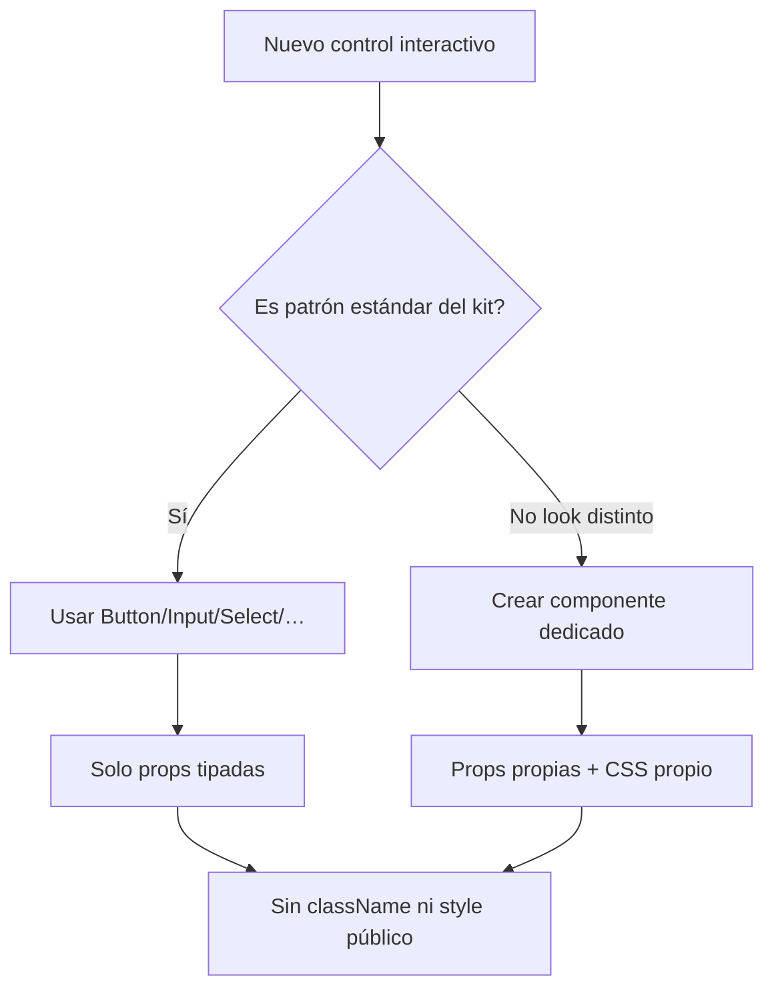

# Auditoría Front y plan de actualización

Documento vivo de la auditoría del renderer frente a las **Rules Front** del proyecto, el plan por fases y el progreso.

Última actualización: 2026-07-19 — **fases 0–5 ejecutadas** (ver §7).

---

## 1. Reglas Front (fuente de verdad)

1. **Componetización alta** y **single responsibility** de componentes.
2. **Extracción** en componentes reutilizables para evitar duplicidad.
3. **Sin `className` ni estilos inline** para modificar el diseño de componentes reutilizables. Solo props tipadas (`size`, `variant`, `width`, `padding`, etc.).
4. **Buenas prácticas** de programación.

### Criterios de interpretación

| Caso | Qué hacer |
|------|-----------|
| Acción / input estándar | UI kit (`Button`, `Input`, …) solo con props. |
| Control **visualmente distinto** | **Componente nuevo** con CSS y props propias. No forzar `Button` ni `className`. |
| Clases BEM internas de un feature | Permitido. |
| `style` geometría runtime / CSS vars internas vía props | Excepción encapsulada. |
| `className` / `style` públicos en `ui/*` o chrome compartido | **Prohibido**. |

Modelo de referencia: [`TerminalModal`](../src/renderer/components/TerminalModal.tsx).

Regla Cursor: [`.cursor/rules/frontend-components.mdc`](../.cursor/rules/frontend-components.mdc).

---

## 2. Inventario UI kit

`Button`, `Input`, `Select`, `TextArea`, `Badge`, `Toggle`, `Spinner`, `Tooltip`, `Icon`, **`ChoiceCard`**.

Contrato en [`ui/index.ts`](../src/renderer/components/ui/index.ts). Guardrail: `npm run check:ui`.

---

## 3. Hallazgos (resumen histórico)

- God files: AgentPane, TerminalPane, FileExplorerTree, App, TabContextsModal, AiPanel.
- Duplicidad pickers provider/loop → resuelta con `ChoiceCard`.
- `className` en Button/Input/Tooltip → eliminado (Fase 0).
- Controles crudos: migrados donde el look es estándar; dedicados donde diverge.

---

## 4. Plan y estado por fases

### Fase 0 — Contrato design system — **HECHA**

- Sin `className` en Button/Input/Tooltip; `pressed` en Button; docs en barrel.

### Fase 1 — Controles crudos — **HECHA (alcance principal)**

- `FontSizeControl` → `Button variant="icon"`.
- AgentPane header: drag/loop/close → `Button`; modes/send/scroll siguen dedicados.
- `ExplorerToolButton` para toolbar explorer/editor.
- Menús contextuales y chrome terminal/tabs quedan como componentes dedicados (look propio).

### Fase 2 — Modales / pickers — **HECHA**

- `ChoiceCard` + provider/loop pickers.
- Footers sin wrappers redundantes (`Confirm`, loop interval).

### Fase 3 — Partir god components — **HECHA (extracciones principales)**

| Antes | Después |
|-------|---------|
| `AgentPane.tsx` monolito | + `AgentPaneHeader`, `AgentPaneMessages`, `AgentPaneFooter` |
| `TabContextsModal` | + `TabContextsList`, `TabContextsEditor`, `tabContextKindIcons` |
| `App.tsx` modales | + `AppModals` |
| `TerminalPane` suggests | + `TerminalSuggestStack` |

Pendiente opcional a futuro: partir más `FileExplorerTree` / resto de `TerminalPane` / AiPanel legacy (no bloquea el contrato Front).

### Fase 4 — Estilos dinámicos — **HECHA**

- `AiErrorBoundary` sin inline cosmético; margin en CSS.
- `zIndex` / `fontSize` siguen como props que setean CSS vars **dentro** del componente (patrón aceptado).
- Virtualizer / splits / tooltips: geometría runtime intacta.

### Fase 5 — Guardrails — **HECHA**

- `.cursor/rules/frontend-components.mdc`
- `scripts/check-ui-contract.mjs` + `npm run check:ui`
- Este documento + checklist

---

## 5. Checklist de PR

- [ ] ¿API reutilizable sin `className`/`style` públicos?
- [ ] ¿Solo props tipadas?
- [ ] ¿Look distinto → componente nuevo?
- [ ] ¿Duplicidad extraída?
- [ ] ¿SRP razonable?
- [ ] ¿`npm run check:ui` OK?

---

## 6. Diagrama de decisión



---

## 7. Orden ejecutado

```
Fase 0 → 1 → 2 → 3 → 4 → 5  (completado 2026-07-19)
```

Siguientes mejoras opcionales (no parte del cierre): más splits de `FileExplorerTree`, migrar ítems de context menu a `MenuItem` dedicado, alinear AiPanel legacy al tocar.
